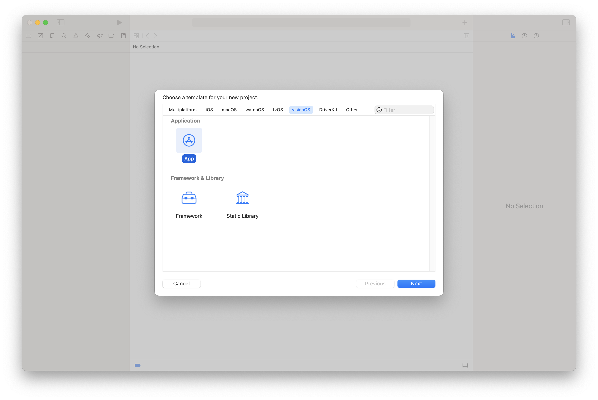
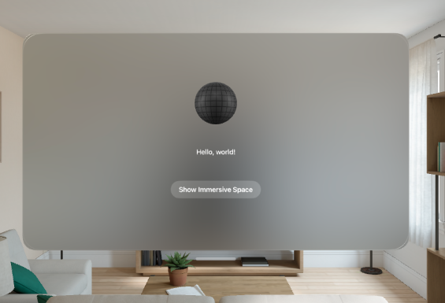
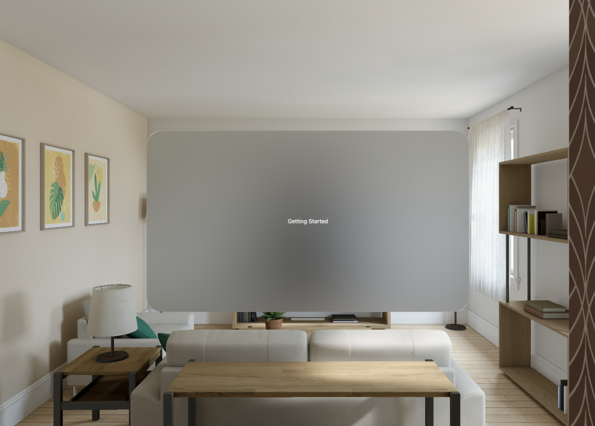
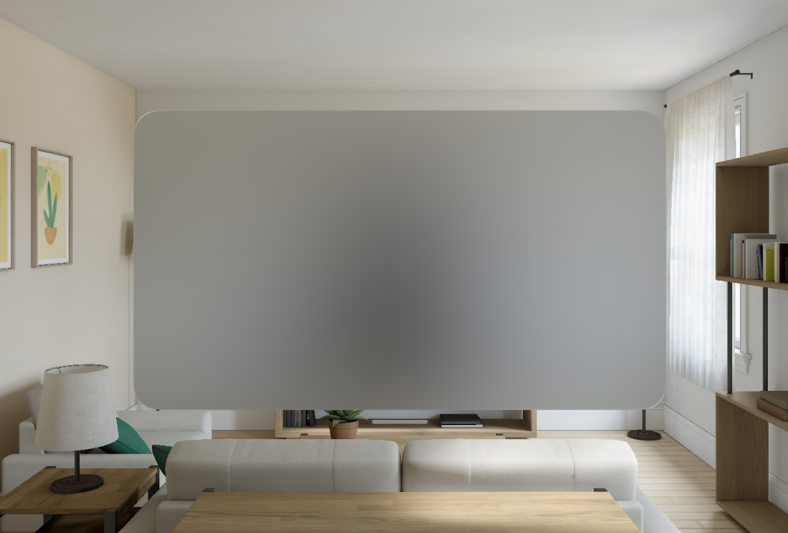
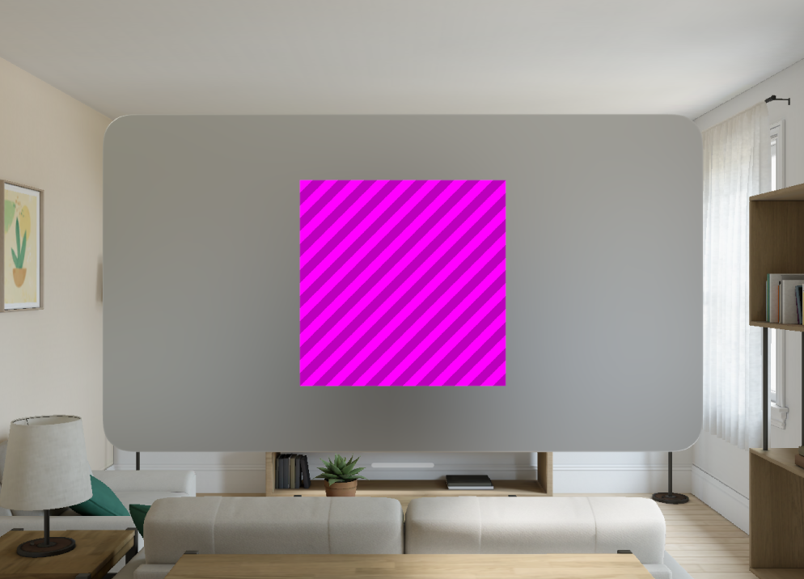

Hi, This is a short guide on how to get up and running with RealityKit on VisionOS.

We'll cover:

- [Getting started with VisionOS](#getting-started-with-visionos)
  - [Installing Required Software ](#installing-required-software-)
  - [Xcode ](#xcode-)
  - [Creating a RealityView ](#creating-a-realityview-)
    - [ContentView ](#contentview-)
    - [ImmersiveView ](#immersiveview-)
    - [Running the Default App ](#running-the-default-app-)
    - [Starting afresh ](#starting-afresh-)
  - [Creating an Entity ](#creating-an-entity-)
  - [Dragging the Entity with Gestures ](#dragging-the-entity-with-gestures-)
  - [Creating a Component ](#creating-a-component-)


## Installing Required Software <a name="software_requirements"></a>

VisionOS is shipped in Xcode 15.2 and later, the easiest way to download this is from [Xcode Releases](https://xcodereleases.com/)

## Xcode <a name="xcode"></a>

We're based in the UK and getting hands-on time with a physical device is currently a challenge, for this guide
we'll be running our examples in Xcode Preview and Simulator.

## Creating a RealityView <a name="realityview"></a>

When you open Xcode 15.2 you'll be asked to create a project, choose `visionOS App`.



This creates a basic template App containing:

- ContentView
- ImmersiveView

The ContentView load the Immersive View when instructed to.

### ContentView <a name="contentview"></a>

You can think of a ContentView as a 2D view presented in 3D space. I think of it as a normal
iOS App, all iOS controls work in this view.

You'll note that you can also move this view around by `holding down` in the white bar at the bottom
of the view, and then moving it to where-ever you want.

### ImmersiveView <a name="immersiveview"></a>

The ImmersiveView contains a pre-made RealityView View, it loads some content from a referenced `RealityKitContent` package.

### Running the Default App <a name="running_the_default"></a>

You can use this App in the Canvas Preview, or via running it in the Simulator, `CMD+R`



### Starting afresh <a name="starting_afresh"></a>

However, we'd like to explain why things work they way they do, so let's delete all of the code in the ImmersiveView

Let's start clean, paste this in:

```swift
import SwiftUI
import RealityKit

struct ImmersiveView {

}

extension ImmersiveView: View {
  var body: some View {
    Text("Getting Started")
  }
}

#Preview {
  ImmersiveView()
    .previewLayout(.sizeThatFits)
}
```

You should see the Preview Canvas update so that it has a Label "Getting Started"



Let's replace the Text Label with a RealityView to load some 3D Content.

```swift
import SwiftUI
import RealityKit

struct ImmersiveView {

}

extension ImmersiveView: View {

  var body: some View {
    realityView
  }

  private var realityView: some View {
    RealityView { content in
      
    }
  }
}

#Preview {
  ImmersiveView()
    .previewLayout(.sizeThatFits)
}
```

If done correctly, the Canvas should update and show... nothing, that's because we haven't asked the RealityView
to draw anything.



You can see the RealityView's closure has a `content` argument, you can think of that as the `scene` into which
we can add content.

The Content that we want to add are `Entities`, we can create one directly in the closure, but let's separate it out a little.

## Creating an Entity <a name="entity"></a>

Let's create a new file called `Shape.swift`, well have a class that can represent a Shape Entity

```swift
import RealityKit

class Shape: Entity {

  required init() {
    super.init()
  }

}
```

If we added that to the `scene` nothing would render as we have no 3D content, let's fix that by adding a 3D Cube as a child entity

```swift
import RealityKit

class Shape: Entity {

  required init() {
    super.init()

    let cube = ModelEntity(mesh: .generateBox(size: 0.25))
    self.addChild(cube)
  }

}
```

It's important to note that the units used in RealityKit are in `meters`, so this cube is `25cm` along each edge.

Entities can have multiple children, and those children cal also have children and so on, so in that sense, you can think of it like a tree of Entities/Nodes

We can now switch back to the `ImmersiveView` and add this Shape to the `scene`.

```swift
import SwiftUI
import RealityKit

struct ImmersiveView {

}

extension ImmersiveView: View {

  var body: some View {
    realityView
  }

  private var realityView: some View {
    RealityView { content in
      let shape = Shape()
      content.add(shape)
    }
  }
}

#Preview {
  ImmersiveView()
    .previewLayout(.sizeThatFits)
}
```

You will see the canvas update, it will display a pink/purple striped cube, use you mouse to move around the scene.

Note: No Texture/Material has been applied to this Cube, we'll cover that in another tutorial.



## Dragging the Entity with Gestures <a name="drag_gesture"></a>

Ok, so we have a 3D cube floating in space...lets make it so that we can move it via dragging it.
We need to add a `DragGesture` to the RealityView

The default implementation can look like this:

```swift
import SwiftUI
import RealityKit

struct ImmersiveView {

}

extension ImmersiveView: View {

  var body: some View {
    realityView
  }

  private var dragGesture: some Gesture {
    DragGesture()
      .onChanged { value in

      }
  }

  private var realityView: some View {
    RealityView { content in
      let shape = Shape()
      shape.position = [0,0,0]
      content.add(shape)
    }
    .gesture(dragGesture)
  }
}

#Preview {
  ImmersiveView()
    .previewLayout(.sizeThatFits)
}
```

Note the new `dragGesture` variable, it's attached to the `RealityView`.

If you try and drag the cube, nothing will happen, why?...

The cube has not been told that it can be interacted with, and to do that, we can use `components`.

## Creating a Component <a name="component"></a>

An `Entity` can have a collection of `Components`,I think of them as traits that the entity has, for example:

An `Entity` can have the `HoverEffectComponent` which RealityView interprets as highlighting the `Entity` when it is hovered over, whether that by via a mouse, or gaze.

In order for the `Cube` to be `Selectable` we need to add the `InputTargetComponent`, and `CollisionComponent`, let's update the code:

```swift
import RealityKit

class Shape: Entity {

  required init() {
    super.init()

    let cube = ModelEntity(mesh: .generateBox(size: 0.25))
    self.addChild(cube)

    self.generateCollisionShapes(recursive: true)
    cube.components.set(InputTargetComponent())
  }

}
```

This tells RealityView that this `Entity` can track input.

However, even with this, our DragGesture still doesn't work, why?

The DragGesture has another method that defines on which entity it affects:

```swift
targetedToEntity
```

This takes a `Component` to filter on, in our demo, we only want to select `Shapes` so let's create a new `ShapeComponent` that only `Shapes` have

```swift
import RealityKit

class ShapeComponent: Component {}
```

We can then attach this to our `Shape` Entity

```swift
import RealityKit

class Shape: Entity {

  required init() {
    super.init()

    let cube = ModelEntity(mesh: .generateBox(size: 0.25))
    self.addChild(cube)

    self.generateCollisionShapes(recursive: true)
    cube.components.set(InputTargetComponent())
    
    cube.components[ShapeComponent.self] = ShapeComponent()
  }

}
```

The `DragGesture` can then be updated to filter on that component

```swift
import SwiftUI
import RealityKit

struct ImmersiveView {

}

extension ImmersiveView: View {

  var body: some View {
    realityView
  }

  private var dragGesture: some Gesture {
    DragGesture()
      .targetedToEntity(where: .has(ShapeComponent.self))
      .onChanged { value in

      }
  }

  private var realityView: some View {
    RealityView { content in
      let shape = Shape()
      shape.position = [0,0,0]
      content.add(shape)
    }
    .gesture(dragGesture)
  }
}

#Preview {
  ImmersiveView()
    .previewLayout(.sizeThatFits)
}
```

If you now run the demo, you can see the `onChanged` handler is called when you try to drag the `Shape`

We can now take the `value` from the `targetedToEntity` to set the new position of the `entity` selected.

```swift
import SwiftUI
import RealityKit

struct ImmersiveView {

}

extension ImmersiveView: View {

  var body: some View {
    realityView
  }

  private var dragGesture: some Gesture {
    DragGesture()
      .targetedToEntity(where: .has(ShapeComponent.self))
      .onChanged { value in
        let entity: Entity = value.entity
        entity.position = value.convert(value.location3D, from: .local, to: entity.parent!)
      }
  }

  private var realityView: some View {
    RealityView { content in
      let shape = Shape()
      shape.position = [0,0,0]
      content.add(shape)
    }
    .gesture(dragGesture)
  }
}

#Preview {
  ImmersiveView()
    .previewLayout(.sizeThatFits)
}

```


So that's not a lot of code to Add a 3D entity and drag it around the scene.