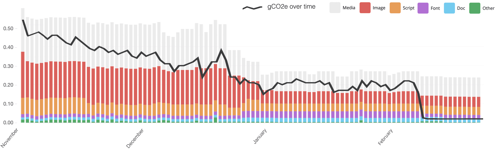

It is easy to detach the intangible and ubiquitous nature of the Internet with the fact that, in reality, it exists on greedy, energy-hungry data centres that are predominantly powered by fossil fuels. There are some horrifying comparisons and statistics that pertain to this, such as having a carbon footprint equivalent to [the entire aviation industry](https://www.climateimpact.com/news-insights/insights/infographic-carbon-footprint-internet/) or it contributes [3.7% of all global greenhouse gas emissions](https://www.bbc.com/future/article/20200305-why-your-internet-habits-are-not-as-clean-as-you-think) and is rising rapidly.

The increase in broadband and data network speeds has prompted more data consumption and heavier websites - [four times heavier in the last ten years](https://httparchive.org/reports/page-weight?start=earliest&end=latest&view=list). In light of this, we decided it was time to measure the carbon footprint of ustwo.com and see what we can do to reduce it.

## Steps we’ve taken 

To begin with, we recognised this simple fact: a smaller and less complicated website will require less energy to store, transfer and view it, therefore it will have a smaller carbon footprint. Ours is [static](https://en.wikipedia.org/wiki/Static_web_page), which means it requires less server power as a matter of course. But there are other things that can be done on any website. Here are some we focussed on:

- Optimise images and use modern formats and techniques, e.g. webp file format
- Decrease the reliance on third party services to reduce requests and transfers.
- Decide if, how and when to show video, e.g. preventing preloading to reduce downloaded data that may never be used.
- Make design and strategy decisions that have an environment-first ethos - e.g. "Do we really need that image/video?" or "Can we use a system font?"
- Write terse copy to arrive at a point quicker - decreasing the time a user needs to reach their goal.

To help us measure our progress we use the tool, [Ecoping](https://ecoping.earth/), which provides reports and insights to inform how and where to reduce our carbon footprint. Where similar tools use a hard coded global average of carbon intensity, Ecoping uses real-time energy consumption data of the regions a website is hosted in, giving much more accurate carbon footprint data.

In November, our website [homepage](https://ustwo.com/) produced __0.54gCO2e__ per visit (already a vast improvement on readings over 1gCO2e earlier in the year). After employing the techniques above, we reduced this to __0.23gCO2e__. This is a great start. It shows that the right mindset and a little technical knowledge can go a long way in this endeavour.

## Choosing the right web host 

Even the simplest of websites will always require energy. So we next turned our attention to those energy-hungry data centres and looked not just at the quantity of energy required, but the __quality__ of that energy. 

Our website has been hosted with [Netlify](https://netlify.com/). It is a modern, robust content delivery network (CDN) that copies the website’s resources to multiple locations around the world to expedite loading times for users. Ecoping presents a list of our website’s resources showing where each of them resides and what impact they have on the environment. European users, for example, load most of the resources from Frankfurt and London, or more precisely, huge data centres owned by Amazon. However, despite having decent renewable energy generation, both Germany and the UK still rely on a [large proportion of fossil fuels](https://app.electricitymaps.com/zone/DE).

<table>
  <tr>
    <th class="tableBold">Type</th>
    <th class="tableMobile tableBold">Count</th>
    <th class="tableBold">Transfer size</th>
    <th class="tableBold">Countries</th>
    <th class="tableBold">Renewable</th>
  </tr>
  <tr class="tableTrShade">
    <td>Media</td>
    <td class="tableMobile">1</td>
    <td>443.7KB</td>
    <td></td>
    <td>34.56%</td>
  </tr>
  <tr>
    <td>Image</td>
    <td class="tableMobile">4</td>
    <td>275.5KB</td>
    <td></td>
    <td>34.56%</td>
  </tr>
  <tr class="tableTrShade">
    <td>Script</td>
    <td class="tableMobile">5</td>
    <td>171.8KB</td>
    <td></td>
    <td>32.46%</td>
  </tr>
  <tr>
    <td>Font</td>
    <td class="tableMobile">4</td>
    <td>147.9KB</td>
    <td></td>
    <td>32.34%</td>
  </tr>
  <tr class="tableTrShade">
    <td>Doc</td>
    <td class="tableMobile">1</td>
    <td>90.3KB</td>
    <td></td>
    <td>30.12%</td>
  </tr>
  <tr>
    <td>Other</td>
    <td class="tableMobile">9</td>
    <td>16.1KB</td>
    <td></td>
    <td>18.82%</td>
  </tr>
</table>

A breakdown of the homepage resources residing mainly on Netlify and Contentful (Amazon data centres in Frankfurt and London) - the proportion of renewable energy powering these servers is low.

But Netlify and Amazon offer cutting edge hosting and deployment services that are modern and easy to use. So would it be possible for us to abstain from using these (and the like) to instead use hosts that have servers powered exclusively with renewable energy?

The [Green Hosting Directory](https://www.thegreenwebfoundation.org/directory/) is a great resource to find environmentally conscious hosting solutions. It is a list of providers that prove their dedication to using green energy. If they are located in regions that have an energy mix that includes fossil fuels, they are likely powered using an energy supplier’s green tariff. 

A quick aside: It’s important to check which energy supplier a host uses. A good one owns or purchases renewable energy directly, therefore investing in and growing the renewable generation infrastructure of that region. But, beware of "Green" or "100% renewable" energy suppliers who buy brown energy wholesale and [greenwash it with Renewable Energy Certificates](https://www.goodenergy.co.uk/learn/greenwashing/).

These green hosts are part of a great initiative, and can be defined as having no or low carbon footprint, but no matter the good intentions and practices, those regions with a proportion of fossil fuels will still have a literal carbon footprint. We wanted to go beyond __saying__ that our website uses renewable energy and __actually__ make our carbon footprint as close to zero as possible.

## Real Green Servers

Fortunately, there are regions in the world that have a complete, if not a large proportion, of renewable energy generation, such as parts of Scandinavia, some provinces of Canada, Costa Rica, Brazil and pockets of north-west America. 

Would using hosts in these regions see a compromise in not just the quality and convenience of Netlify and Amazon, but also loading times due to their less optimal locations, i.e. not a well positioned, Central European location such as Frankfurt?

Well, we thought we’d give it a go - our website is now hosted on our own green network. We’ve chosen servers in Oslo, Montreal and Seattle to begin with. Together they are powered by an annual average of 98% renewable energy (almost exclusively hydroelectric).

The website is deployed to all servers which are hosted by independent companies based in the same region. A Geo DNS service directs each user to their closest server depending on their location, thus reducing load times in an attempt to match Netlify. For example, European users will be served by Oslo, whereas North American users will be served by Montreal or Seattle. Encouragingly, the table below shows that load times are comparable. However, Sydney is below par, so an additional host to serve our users in Australia and East Asia would be a good next step - [Tasmania might be a good option](https://app.electricitymaps.com/zone/AU-TAS).

<table>
  <tr>
    <th></th>
    <th>London</th>
    <th>Frankfurt</th>
    <th>W' D.C</th>
    <th>San Fran</th>
    <th>Tokyo</th>
    <th>Sydney</th>
  </tr>
  <tr class="tableTrShade">
    <td class="tableBold">Netlify</td>
    <td class="tableBold">340ms</td>
    <td class="tableBold">201ms</td>
    <td class="tableBold">377ms</td>
    <td class="tableBold">428ms</td>
    <td class="tableBold">1.62s</td>
    <td class="tableBold">1.65s</td>
  </tr>
  <tr>
    <td></td>
    <td></td>
    <td></td>
    <td></td>
    <td></td>
    <td></td>
    <td></td>
  </tr>
  <tr>
    <td>Oslo</td>
    <td>248ms</td>
    <td>256ms</td>
    <td>915ms</td>
    <td>1.56s</td>
    <td>2.56s</td>
    <td>2.76s</td>
  </tr>
  <tr>
    <td>Montreal</td>
    <td>761ms</td>
    <td>890ms</td>
    <td>214ms</td>
    <td>720ms</td>
    <td>2.43s</td>
    <td>1.92s</td>
  </tr>
  <tr>
    <td>Seattle</td>
    <td>1.49s</td>
    <td>1.58s</td>
    <td>855ms</td>
    <td>524ms</td>
    <td>1.35s</td>
    <td>2.57s</td>
  </tr>
  <tr class="tableTrShade">
    <td class="tableBold">Green Net.</td>
    <td class="tableBold" style="color:green">248ms</td>
    <td class="tableBold" style="color:green">256ms</td>
    <td class="tableBold" style="color:green">214ms</td>
    <td class="tableBold" style="color:orange">524ms</td>
    <td class="tableBold" style="color:green">1.35s</td>
    <td class="tableBold" style="color:red">2.57s</td>
  </tr>
</table>
Testing load times from different locations using Pingdom: we compare Netlify with our three servers individually, then together as our green server network

## Proof of Concept

The estimated average carbon footprint per visit of a webpage can vary from 0.5gCO2e to 1.76gCO2e depending on what you read. Our homepage now produces just __0.02gCO2e__ per visit. Comparing, even to the lowest average, this is a vast difference.

There have been a few challenges to overcome that would otherwise “just work” with Netlify: overcoming quirks with SSL certificates across multiple servers; reinstating fast and convenient deployment workflows (we are now using Github Actions - we’d like to run all this on green servers too sometime!) not to mention finding the hosting companies we wanted to work with.

Also, although all the code and every resource on the homepage is hosted on our green network, many of the images on the website are still hosted in the London data centre. But, we are already on the case with migrating everything away from the old infrastructure - a more tech-focussed post will follow to outline everything we’ve done.

We understand this will not be a realistic solution for many websites and setups.  Our website has simple functionality and modest traffic, so we have the luxury of experimenting and making small compromises that ultimately allows us to choose a strategy that prioritises the environment.  But, we believe there will be something everyone can do, even if it’s small. The key is to have an environment-first mindset. Then, employing techniques to reduce the energy consumed by websites will become a responsibility that we all share.

<table>
  <tr>
    <th class="tableBold">Type</th>
    <th class="tableMobile tableBold">Count</th>
    <th class="tableBold">Transfer size</th>
    <th class="tableBold">Countries</th>
    <th class="tableBold">Renewable</th>
  </tr>
  <tr class="tableTrShade">
    <td>Media</td>
    <td class="tableMobile">1</td>
    <td>430.7KB</td>
    <td></td>
    <td>99.00%</td>
  </tr>
  <tr>
    <td>Image</td>
    <td class="tableMobile">4</td>
    <td>224.1KB</td>
    <td></td>
    <td>99.00%</td>
  </tr>
  <tr class="tableTrShade">
    <td>Script</td>
    <td class="tableMobile">7</td>
    <td>176.2KB</td>
    <td></td>
    <td>90.55%</td>
  </tr>
  <tr>
    <td>Font</td>
    <td class="tableMobile">2</td>
    <td>73.8KB</td>
    <td></td>
    <td>99.00%</td>
  </tr>
  <tr class="tableTrShade">
    <td>Doc</td>
    <td class="tableMobile">1</td>
    <td>97.5KB</td>
    <td></td>
    <td>99.00%</td>
  </tr>
  <tr>
    <td>Other</td>
    <td class="tableMobile">9</td>
    <td>31.3KB</td>
    <td></td>
    <td>61.88%</td>
  </tr>
</table>

A breakdown of the homepage resources now residing on our Green Network from a European user's point of view - a much greener proportion of renewables

## Awareness of Internet Pollution

Doing all this for one website might all seem like a drop in the ocean, but our intention is to learn about and spread awareness of Internet pollution. It’s been instilled in us that driving a car, taking a flight, even leaving the light on has an impact on the environment. But that mindset doesn’t extend to Internet usage yet.  We treat it as an infinite resource, while knowing resources that currently power it are finite. We've disassociated these two things that are intrinsically linked. 

The big tech companies claim they are moving in the right direction with regards to reducing their impact on the environment, but, ultimately, while their data centres reside in regions that are not wholly powered by renewables, then the websites they contain will continue to have a carbon footprint.