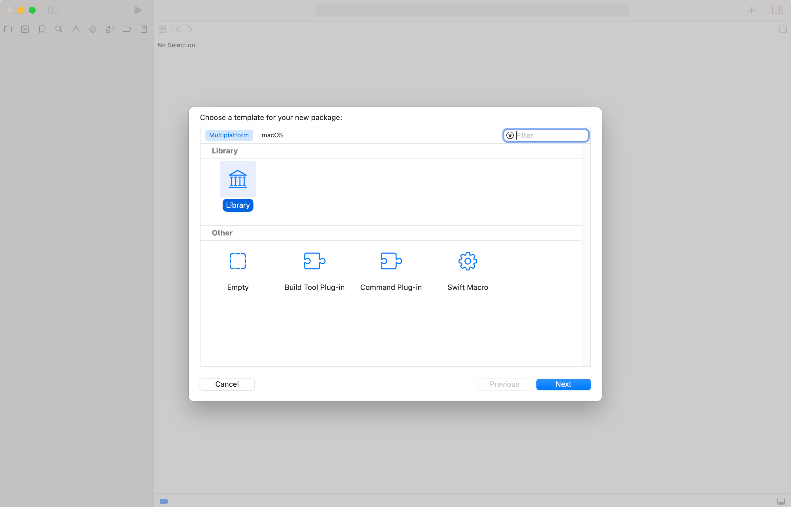
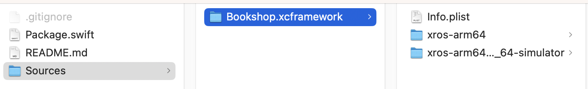

Swift packages are a wonderful way of distributing code to use in projects.
They are simple to use, you add the URL to a repo in Xcode and the dependency is added to your project.
Almost like magic.

Casual users will deploy their Swift package as pure Swift code, however this has some drawbacks (if you see them as drawbacks)

- Your code is public, without correct licensing it could be used and abused

What if there was a way to offer a Swift package to your consumers without having to share your source code?

We'll cover:

- [Swift package binary targets ](#binary_targets)
- [Creating your private Swift package ](#private_package)
- [Creating an XCFramework ](#create_xcframework)
  - [Platforms ](#platforms)
  - [Script ](#script)
  - [Merging ](#merging)
  - [Static vs dynamic ](#static_dynamic)
- [Creating your public Swift package ](#public_package)
  - [Deploy ](#deploy)
- [Importing ](#importing)
  - [Fail to import ](#failure)
  - [Modules ](#modules)
- [Useful commands ](#useful_commands)

## Swift package binary targets <a name="binary_targets"></a>

They were built with this in mind.

In this tutorial I'll show you how to create a Swift package that can be exported as an XCFramework
which is used in a distributed Swift package.

At the end you will have:

- A private Swift package with your original source
- A public Swift package that contains an XCFramework which you can distribute freely

## Creating your private Swift package <a name="private_package"></a>

Create a new Swift package.



I've called my package `Bookshop`.

You'll see the `Package.swift`, I've set the supported platforms to be `visionOS`.

```swift
// swift-tools-version: 5.9
// The swift-tools-version declares the minimum version of Swift required to build this package.

import PackageDescription

let package = Package(
    name: "Bookshop",
    platforms: [.visionOS(.v1)],
    products: [
        // Products define the executables and libraries a package produces, making them visible to other packages.
        .library(
            name: "Bookshop",
            targets: ["Bookshop"]),
    ],
    targets: [
        // Targets are the basic building blocks of a package, defining a module or a test suite.
        // Targets can depend on other targets in this package and products from dependencies.
        .target(
            name: "Bookshop"),
        .testTarget(
            name: "BookshopTests",
            dependencies: ["Bookshop"]),
    ]
)
```

I'm going to add a single method to the `Bookshop.swift` file so that we have something to use.

```swift
public class Bookshop {
  public func buy(book: String) {
    print("Book: \(book) purchased")
  }
}
```

**Note** I've made the class and method public so that we can use them from other code.


## Creating an XCFramework <a name="create_xcframework"></a>

We're now going to create an `*.xcframework` file that consumers can use in their app

### Platforms <a name="platforms"></a>

You'll note that when using Xcode, you can use the Simulator, or run on Device, classically these devices have different architectures, ie, `x86`, `arm64`.
This means that we are going to need to create an XCFramework with multiples `slices` per architecture.
If we didn't do this, the package wouldn't run.

### Script <a name="script"></a>

We need to build the physical device slice

```bash
SCHEME="Bookshop"
xcodebuild archive -workspace . -scheme $SCHEME -destination "generic/platform=visionOS" -archivePath /tmp/xcf/xros.xcarchive -derivedDataPath /tmp/visionos -sdk xros SKIP_INSTALL=NO BUILD_LIBRARY_FOR_DISTRIBUTION=YES
```

Then create the build for the simulator slice

```bash
SCHEME="Bookshop"
xcodebuild archive -workspace . -scheme $SCHEME -destination "generic/platform=visionOS Simulator" -archivePath /tmp/xcf/xrsimulator.xcarchive -derivedDataPath /tmp/visionos -sdk xrsimulator SKIP_INSTALL=NO BUILD_LIBRARY_FOR_DISTRIBUTION=YES
```

### Merging <a name="merging"></a>

We have both frameworks, however, how do we create a single `XCFramework` from them?

```bash
xcodebuild -create-xcframework -framework $(readlink -f "/tmp/xcf/xros.xcarchive/Products/usr/local/lib/Bookshop.framework") -framework $(readlink -f "/tmp/xcf/xrsimulator.xcarchive/Products/usr/local/lib/Bookshop.framework") -output "/tmp/xcf/Bookshop.xcframework"
```

### Static vs dynamic <a name="static_dynamic"></a>

If you run the last script, it will fail...this is because as it stands, the Swift package produces a static framework, and the output is an `object` file, not a `framework`.

We can fix this by modifying the `Package.swift` to:

```swift
// swift-tools-version: 5.9
// The swift-tools-version declares the minimum version of Swift required to build this package.

import PackageDescription

let package = Package(
    name: "Bookshop",
    platforms: [.visionOS(.v1)],
    products: [
        // Products define the executables and libraries a package produces, making them visible to other packages.
        .library(
            name: "Bookshop",
            type: .dynamic,
            targets: ["Bookshop"]),
    ],
    targets: [
        // Targets are the basic building blocks of a package, defining a module or a test suite.
        // Targets can depend on other targets in this package and products from dependencies.
        .target(
            name: "Bookshop"),
        .testTarget(
            name: "BookshopTests",
            dependencies: ["Bookshop"]),
    ]
)
```

Run the scripts again.

## Creating your public Swift package <a name="public_package"></a>

Create a new Swift package and copy the generated `xcframework` into the `Sources` folder.

Update your new `Package.swift` to reference the `xcframework`.

```swift
// swift-tools-version: 5.9
// The swift-tools-version declares the minimum version of Swift required to build this package.

import PackageDescription

let package = Package(
    name: "Bookshop",
    platforms: [.visionOS(.v1)],
    products: [
        // Products define the executables and libraries a package produces, making them visible to other packages.
        .library(
            name: "Bookshop",
            targets: ["BookshopFramework"]),
    ],
    targets: [
        .binaryTarget(name: "BookshopFramework",
                      path: "assets/Sources/Bookshop.xcframework")
    ]
)
```

### Deploy <a name="deploy"></a>

Deploy this package, your folder structure should be succinct to GitHub, ie, you should not see any of your public code.



## Importing <a name="importing"></a>

Inside of Xcode import the package, use the GitHub url.

### Fail to import <a name="failure"></a>

You can now use the code in your app...or can you?

```swift
import Bookshop

public class MyApp {

  func init() {
    let bookshop = Bookshop()
    bookshop.buy(book: "some_book")
  }

}
```

If you try to compile, you get `No such module Bookshop`...why is that?

### Modules <a name="modules"></a>

We have an `XCFramework` but to Xcode it's a bunch of data, like being on an island without a map, we need a map, specifically a `modulemap`

Let's modify the scripts so that we can include the generated `swiftmodule` in our `framework`.

We need to build the physical device slice

```bash
SCHEME="Bookshop"
xcodebuild archive -workspace . -scheme $SCHEME -destination "generic/platform=visionOS" -archivePath /tmp/xcf/xros.xcarchive -derivedDataPath /tmp/visionos -sdk xros SKIP_INSTALL=NO BUILD_LIBRARY_FOR_DISTRIBUTION=YES
mkdir /tmp/xcf/xros.xcarchive/Products/usr/local/lib/Bookshop.framework/Modules
cp -a /tmp/visionos/Build/Intermediates.noindex/ArchiveIntermediates/Bookshop/BuildProductsPath/Release-xros/Bookshop.swiftmodule /tmp/xcf/xros.xcarchive/Products/usr/local/lib/Bookshop.framework/Modules
```

Then create the build for the simulator slice

```bash
SCHEME="Bookshop"
xcodebuild archive -workspace . -scheme $SCHEME -destination "generic/platform=visionOS Simulator" -archivePath /tmp/xcf/xrsimulator.xcarchive -derivedDataPath /tmp/visionos -sdk xrsimulator SKIP_INSTALL=NO BUILD_LIBRARY_FOR_DISTRIBUTION=YES
mkdir /tmp/xcf/xrsimulator.xcarchive/Products/usr/local/lib/Bookshop.framework/Modules
cp -a /tmp/visionos/Build/Intermediates.noindex/ArchiveIntermediates/Bookshop/BuildProductsPath/Release-xrsimulator/Bookshop.swiftmodule /tmp/xcf/xrsimulator.xcarchive/Products/usr/local/lib/Bookshop.framework/Modules
```

Recombine the two `framework`s to make a single `XCFramework`

```bash
xcodebuild -create-xcframework -framework $(readlink -f "/tmp/xcf/xros.xcarchive/Products/usr/local/lib/Bookshop.framework") -framework $(readlink -f "/tmp/xcf/xrsimulator.xcarchive/Products/usr/local/lib/Bookshop.framework") -output "/tmp/xcf/Bookshop.xcframework"
```

Re-run the script and re-upload your Package to GitHub.

When you now import, you can buy your book. Magic.

## Useful commands <a name="useful_commands"></a>

You may not know what Xcode version, or SDKs you have installed on your system, these one-liners can help you out:

- What version of Xcode am I using?

```bash
xcode-select -p
```

- What destinations are available for the scheme?

```bash
xcodebuild -showdestinations -scheme Bookshop
```

- What SDKs do I have installed?

```bash
xcodebuild -showsdks
```